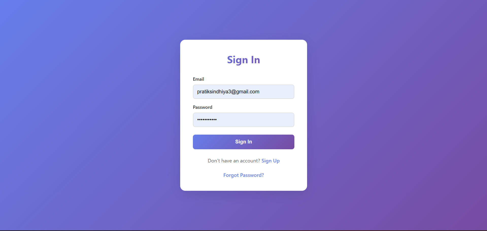
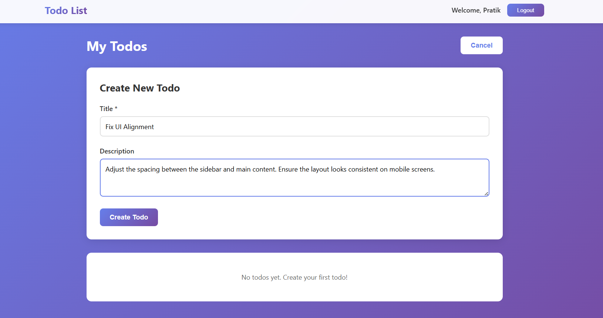
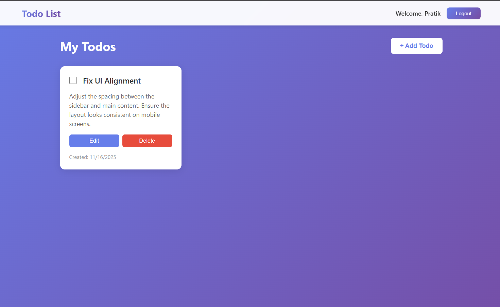
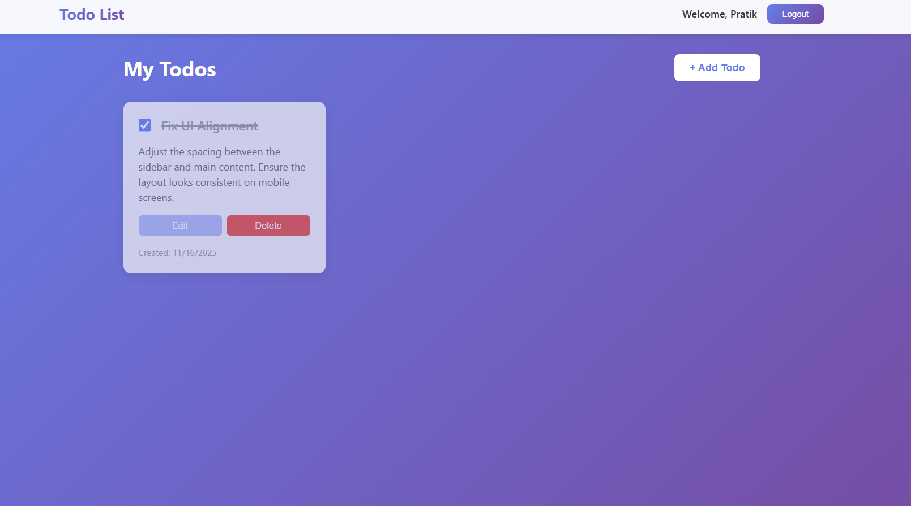

# Todo List Application

This is my full-stack Todo List application built using TypeScript on both the frontend and backend. Users can sign up, log in, and manage their personal todos. I created this project to practice full-stack development and deployment.


## Features

### Todo Functions
- Add todo
- Edit todo
- Delete todo
- Mark completed
- View all todos

### Authentication
- Sign up
- Login
- Logout
- Forgot password (reset token shown in API response)
- Reset password



## Tech Stack

### Frontend
- React + TypeScript
- Vite
- Zustand
- React Query
- React Router
- Axios
- React Hook Form
- Zod

### Backend
- Node.js + Express
- TypeScript
- MongoDB + Mongoose
- JWT
- bcryptjs
- Zod

## Installation & Setup

### 1. Clone
```bash
git clone https://github.com/PRATIKSINDHIYA/Todoapp.git
cd Todoapp
````

### 2. Backend Setup

```bash
cd backend
npm install
```

Create `.env`:

```
PORT=5000
MONGODB_URI=your_mongodb_uri
JWT_SECRET=your_secret_key
JWT_EXPIRES_IN=7d
NODE_ENV=development
```

Start backend:

```bash
npm run dev
```

### 3. Frontend Setup

```bash
cd frontend
npm install
```

(Optional) `.env`:

```
VITE_API_URL=http://localhost:5000/api
```

Start frontend:

```bash
npm run dev
```

## How to Use

1. Sign up
2. Log in
3. Add todos



4. View all your todos



5. Edit or delete
6. Mark completed



## Assumptions

* Reset token is returned in API for demo
* CORS is open for development
* `.env` is created manually

## Notes

This project was built as part of an assignment to practice full-stack development.

